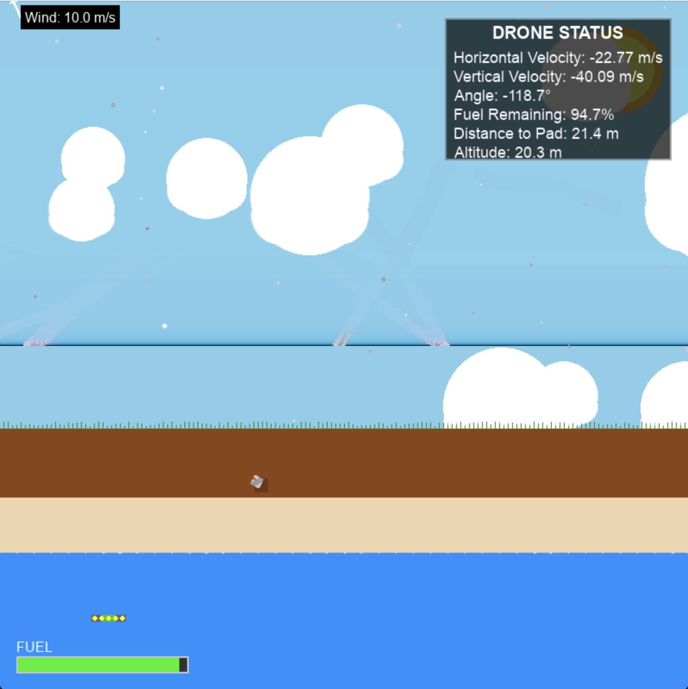
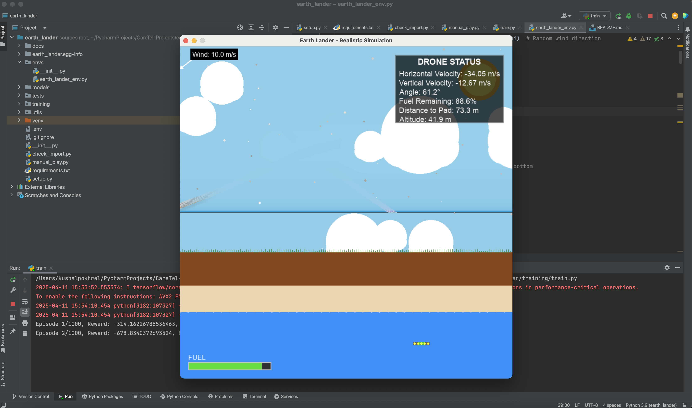

# Earth Lander Simulation

A custom OpenAI Gym environment simulating a drone landing on Earth with dynamic wind conditions and randomized landing targets. Built with reinforcement learning experimentation in mind.

---

## ✍️ Project Author

**Kushal Pokhrel**  
*Australian Institute of Higher Education*  
📧 Personal: thekushalpokhrel@gmail.com  
📧 Professional: k.pokhrel@aih.edu.au  

---

## ✍️ Project Supervisor

**Prof. Cesar Sanin**
*Australian Institute of Higher Education*
📧 Professional: c.sanin@aih.edu.au 

---

## 🔒 License & Usage Restrictions

This project is **licensed for academic and experimental use only**.  
**Commercial usage, redistribution, or modification for profit is strictly prohibited.**

> © 2025 Kushal Pokhrel | Australian Institute of Higher Education . All rights reserved.

To request special permissions or collaboration, please contact: k.pokhrel@aih.edu.au

---

## 🚀 Features

- 🌍 Earth-inspired environment with beach, ocean, and sky visuals
- 🚁 Realistic drone-style lander physics
- 💨 Simulated 10 m/s wind with dynamic direction shifts
- 🎯 Randomized landing pads per episode
- 🕹️ Manual and automated control support
- 🤖 Fully compatible with reinforcement learning algorithms
- 🧪 Customizable environment parameters for experimentation



---

## 📦 Installation

1. **Clone the repository**:

   ```bash
   git clone https://github.com/kushalpokhrel/earth_lander_sim.git
   cd earth_lander_sim
   ```

2. **Install dependencies**:

   ```bash
   pip install -r requirements.txt
   ```

3. **Install the package in development mode**:

   ```bash
   pip install -e .
   ```

---

## 🧠 Usage

### ➤ Training an Agent

```bash
python -m earth_lander.training.train
```

Progress is saved to:

- `training/metrics/` – Logs and metrics  
- `models/` – Model checkpoints

---

### ➤ Evaluating a Trained Model

```bash
python -m earth_lander.training.evaluate --model_path models/earth_lander_final.keras
```

---

### ➤ Manual Control (for testing)

```python
import gymnasium as gym
import earth_lander

env = gym.make('EarthLander-v2', render_mode="human")
obs, _ = env.reset()

for _ in range(1000):
    action = env.action_space.sample()
    obs, reward, terminated, truncated, info = env.step(action)
    if terminated or truncated:
        obs, _ = env.reset()

env.close()
```

---

## 🔧 Environment Details

### Action Space: `Box(3,)`

- `[0]`: Left thruster power (0.0 to 1.0)  
- `[1]`: Right thruster power (0.0 to 1.0)  
- `[2]`: Bottom thruster power (0.0 to 1.0)  

### Observation Space: `Box(9,)`

- `[0]`: X position  
- `[1]`: Y position  
- `[2]`: X velocity  
- `[3]`: Y velocity  
- `[4]`: Angle (radians)  
- `[5]`: Angular velocity  
- `[6]`: Left ground contact (bool)  
- `[7]`: Right ground contact (bool)  
- `[8]`: Remaining fuel  

### Reward Structure

- ✅ Landing on pad: +100  
- 💥 Crash: -100  
- 📉 Penalties for distance, velocity, and tilt  
- ⛽ Bonus for fuel conservation  

---

## 🛠️ Customization

```python
from earth_lander.envs.earth_lander_env import EarthLanderEnv

env = EarthLanderEnv(
    gravity=9.81,
    wind_speed=10.0,
    initial_fuel=100.0,
    max_thrust=15.0,
    render_mode="human"
)
```

---

## 🗂️ Project Structure

```
earth_lander/
├── earth_lander/
│   ├── envs/                  # Environment definitions
│   ├── utils/                 # Helper functions
│   └── training/              # Training and evaluation scripts
├── tests/                     # Unit tests
├── docs/                      # Documentation and demo media
├── models/                    # Saved models
├── training/metrics/          # Training logs
├── manual_play.py             # Manual testing script
├── requirements.txt
├── setup.py
└── .gitignore
```

---

## 🤝 Contributions

Contributions are welcome! Please open an issue or pull request for bug fixes, improvements, or new features.

---

## 📜 Disclaimer

This project is provided "as-is" for academic, educational, and non-commercial experimentation purposes only. The author makes no guarantees of fitness for any purpose. Use at your own risk.

---
